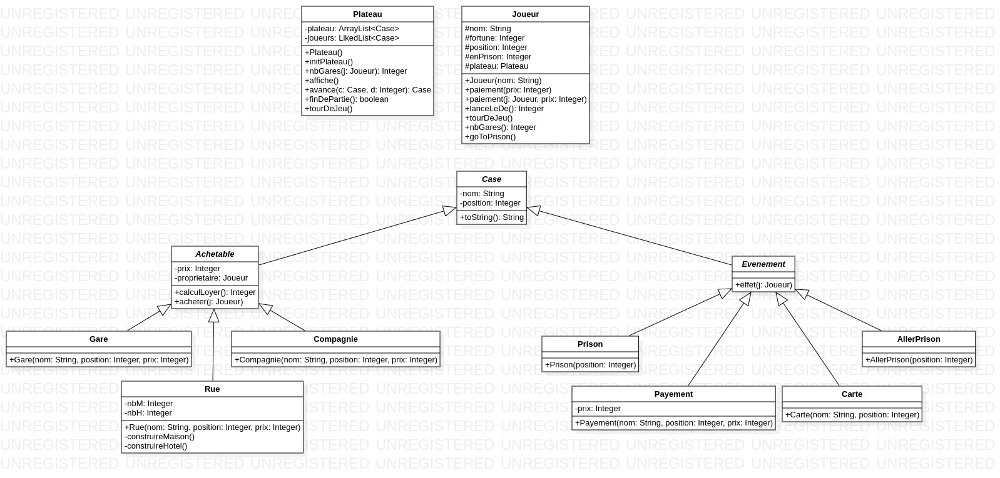

# Monopoly - MEDEV (EI2)

## Organisation

Le projet a été segmenté en trois parties/équipes :

- Plateau
    - Clara MATTOS
    - Fernando ROJAS
    - Augusto ARROJO DE DEUS
    - Tatsuya OCHI
    - Samer AYYOUB

- Joueur
    - Corentin POULET
    - Arman MOLA
    - Timothée PETIT
    - Ulysse LACOUSTILLE

- Case
    - Victor SIMON
    - Thomas RUAUX
    - Titouan BROUSSE
    - Lorenzo Barbo
    - Paul MAUNY
    - Nadhem BEN WAHIDA

[Google Docs](https://docs.google.com/document/d/1aSimT0o8QkMoVoalPzR4vFFT4kl3dkfxN9x6mBdY-sM/edit?usp=sharing)

## Diagramme de Classes

